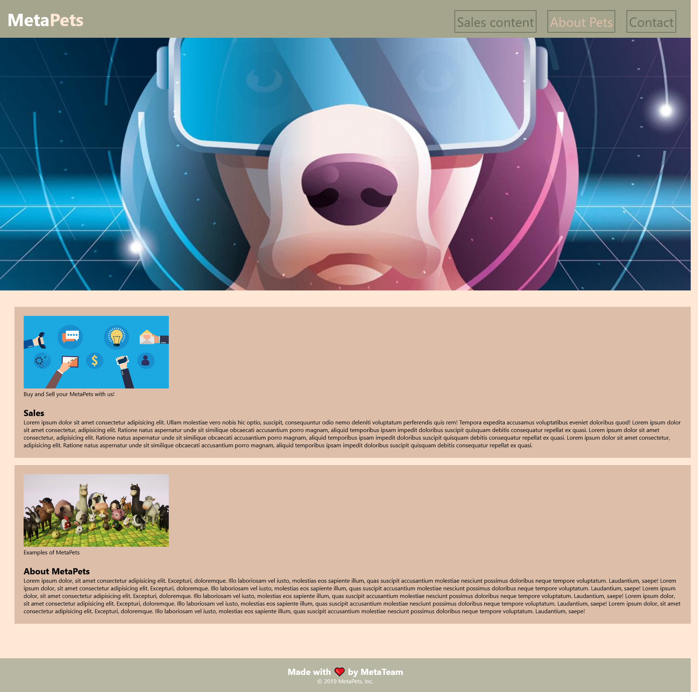

# Mini-project

## What is it?

This is a mini-group-project done with three other students. The webpage theme is
about metaverse-pets and their market. The website contains **links** to **scroll down** the
page to important sections, as well as a working **submission page** and **return to homepage
buttons**.

## Purpose

The project purpose is to practice working with **HTML** and **CSS** to design a webpage that both
looks asthetically pleasing, as well as functions as intended. The use of **HTML semantic elements**
and **CSS styling** are the main focus of this project.

## Finished Product

Link to live [MetaPets Webpage](https://vidalatan.github.io/Mini-project/)
Link to [Code Repository](https://github.com/Vidalatan/Mini-project)
